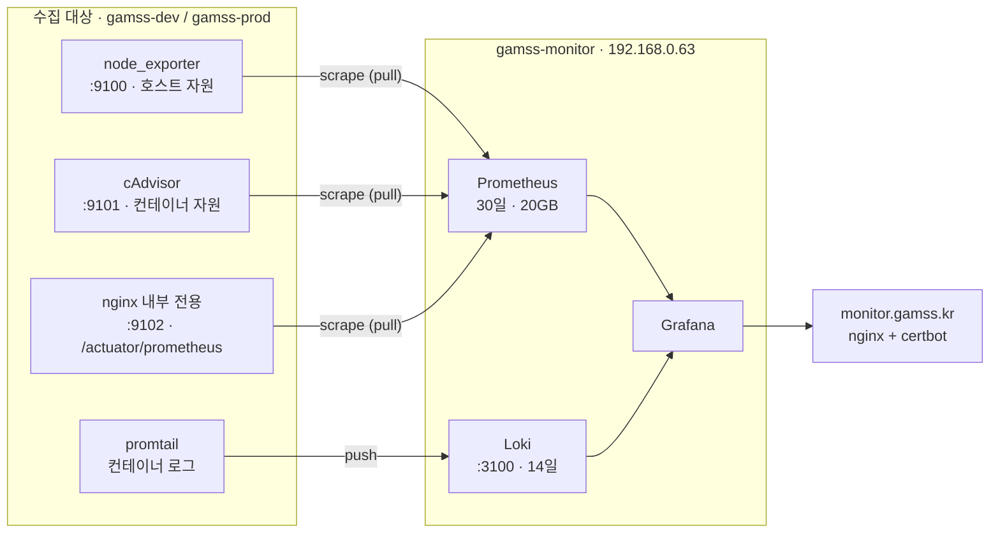

# 모니터링 서버 (gamss-monitor)

Grafana + Prometheus + Loki 스택. dev·prod 를 사설망으로 수집하고 `monitor.gamss.kr` 로 공개한다.

| 항목    | 값                                        |
|-------|------------------------------------------|
| 서버    | `gamss-monitor` · High CPU 2vCore/4GB/50GB · Ubuntu 24.04 |
| 사설 IP | `192.168.0.63` (수집·로그 수신)                |
| 공인 IP | `1.201.126.136` → `monitor.gamss.kr`     |
| 대상    | `gamss-dev` `192.168.0.231` · `gamss-prod` `192.168.0.141` |

관측 대상과 관측 도구를 분리한 구성이다. 앱 서버가 죽어도 알림은 살아 있어야 하므로 스택을 별도
서버에 둔다. 같은 이유로 이 서버는 CD 대상이 아니다 — 배포 파이프라인이 고장났을 때 관측까지
함께 잃지 않도록 갱신은 아래 절차로 수동으로 한다.

## 수집 경로



- 스크레이프 포트는 **사설 IP 에만 바인딩**한다. 도커의 포트 publish 는 ufw 를 우회하므로
  (`DOCKER-USER` 체인이 먼저 걸린다) 바인딩 주소가 호스트단의 사실상 유일한 방어선이다.
  가비아 보안그룹에서도 모니터링 서버 사설 IP 만 허용해 이중으로 막는다.
- 앱 메트릭은 앱 포트를 열지 않고 **nginx 내부 전용 server 블록(9102)** 이 `/actuator/prometheus`
  하나만 프록시한다. 앱 API 전체를 사설망에 노출하지 않기 위해서다.

## 최초 세팅

```bash
# 1. 로컬에서 서버 초기 세팅 스크립트 전송·실행 (Docker, ufw, 로그 로테이션)
scp -i ~/nexters/ssh-keypair-gamss-monitor.pem deploy/setup-server.sh ubuntu@1.201.126.136:/tmp/
ssh -i ~/nexters/ssh-keypair-gamss-monitor.pem ubuntu@1.201.126.136 'sudo bash /tmp/setup-server.sh ubuntu'

# 2. 스택 파일 전송
scp -i ~/nexters/ssh-keypair-gamss-monitor.pem -r deploy/monitor/. ubuntu@1.201.126.136:~/app/

# 3. 서버에서 .env 작성 (.env.example 참고)
ssh -i ~/nexters/ssh-keypair-gamss-monitor.pem ubuntu@1.201.126.136
cp ~/app/.env.example ~/app/.env && chmod 600 ~/app/.env && vi ~/app/.env

# 4. 인증서 부트스트랩 (닭과 달걀 풀기)
#    nginx 는 443 블록의 인증서 파일이 없으면 기동조차 못 하고, 인증서는 80 으로 오는 ACME
#    챌린지를 nginx 가 받아줘야 발급된다. 그래서 자기서명 더미 인증서로 nginx 를 먼저 띄운다.
cd ~/app
docker compose run --rm --entrypoint sh certbot -c \
  'mkdir -p /etc/letsencrypt/live/monitor && openssl req -x509 -nodes -newkey rsa:2048 -days 1 \
   -keyout /etc/letsencrypt/live/monitor/privkey.pem \
   -out /etc/letsencrypt/live/monitor/fullchain.pem -subj "/CN=monitor.gamss.kr"'
docker compose up -d nginx

#    더미를 지우고 진짜를 받는다. nginx 는 이미 인증서를 메모리에 올려둔 상태라 파일이 사라져도
#    계속 뜬 채로 챌린지를 서빙한다. 발급 후 reload 하면 진짜 인증서로 갈아탄다.
docker compose run --rm --entrypoint sh certbot -c 'rm -rf /etc/letsencrypt/live/monitor'
docker compose run --rm --entrypoint certbot certbot certonly \
  --webroot -w /var/www/certbot --cert-name monitor -d monitor.gamss.kr \
  --email <이메일> --agree-tos --no-eff-email
docker compose exec -T nginx nginx -s reload

# 5. 전체 기동
docker compose up -d
```

`monitor.gamss.kr` A 레코드가 `1.201.126.136` 로 이미 떠 있어야 4번이 성공한다.

## 갱신 (설정·대시보드 변경 후)

```bash
scp -i ~/nexters/ssh-keypair-gamss-monitor.pem -r deploy/monitor/. ubuntu@1.201.126.136:~/app/
ssh -i ~/nexters/ssh-keypair-gamss-monitor.pem ubuntu@1.201.126.136 \
  'cd ~/app && docker compose up -d && docker compose exec -T nginx nginx -s reload'
```

Prometheus 설정만 바꿨다면 재기동 없이 반영할 수 있다(`--web.enable-lifecycle` 켜져 있음):

```bash
docker compose exec -T prometheus kill -HUP 1
```

## 보존 정책

디스크(50GB)가 메모리보다 먼저 찬다. 양쪽 다 상한을 걸어뒀다.

| 대상         | 정책                  | 위치                          |
|------------|---------------------|-----------------------------|
| Prometheus | 30일 · 20GB 중 먼저 걸리는 쪽 | `docker-compose.yml` command |
| Loki       | 14일 (compactor 가 실제 삭제) | `loki/loki.yml`             |

## 접근 정보

- 대시보드: https://monitor.gamss.kr — 계정은 GitHub 시크릿 `GRAFANA_ADMIN_USER`·`GRAFANA_ADMIN_PASSWORD`
  (서버 `.env` 에도 같은 값이 들어 있다)
- 데이터소스·대시보드·알림은 전부 프로비저닝이라 **UI 에서 고쳐도 재기동 시 덮어써진다.**
  변경은 `grafana/` 아래 파일을 고쳐 커밋한 뒤 위 갱신 절차를 따른다.

## 계정 변경

`GF_SECURITY_ADMIN_USER`·`GF_SECURITY_ADMIN_PASSWORD` 는 **컨테이너를 처음 띄울 때만** 반영된다.
이후로는 Grafana 내부 DB 의 계정이 정본이라 `.env` 만 고치고 재기동해도 바뀌지 않는다.
운영 중에는 아래처럼 관리 API 로 바꾸고, `.env` 와 GitHub 시크릿도 같은 값으로 맞춰둔다(다음 재설치 때 쓰인다).

```bash
cd ~/app
# 아이디 변경
docker compose exec -T grafana curl -s -u <현재ID>:<현재PW> -X PUT localhost:3000/api/users/1 \
  -H 'Content-Type: application/json' -d '{"login":"<새ID>","email":"admin@gamss.kr","name":"GAMSS Admin"}'
# 비밀번호 변경(아이디를 먼저 바꿨다면 새 아이디로 인증한다)
docker compose exec -T grafana curl -s -u <새ID>:<현재PW> -X PUT localhost:3000/api/admin/users/1/password \
  -H 'Content-Type: application/json' -d '{"password":"<새PW>"}'
```
